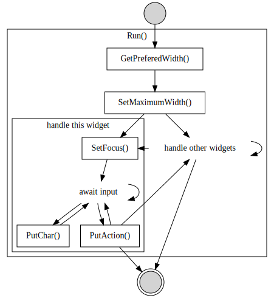

# Tobylog

A basic TUI dialog library

## Quickstart

**TODO**

## Widgets

- Label (*label.h*)
- Text Field (*text.h*)

### Custom Widgets

**TODO**

## Dependencies

- *Apache Portable Runtime*
- *ncurses*
